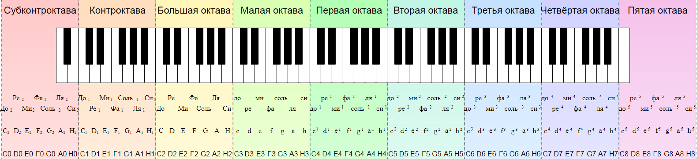
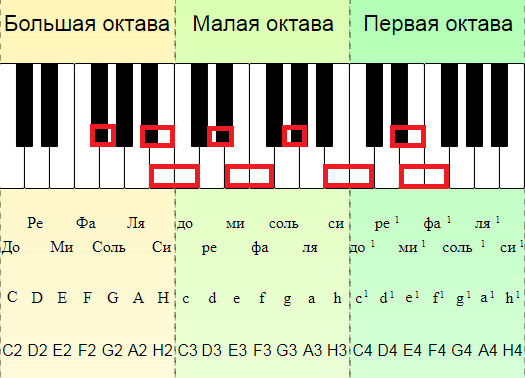
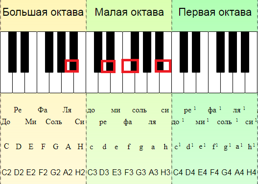
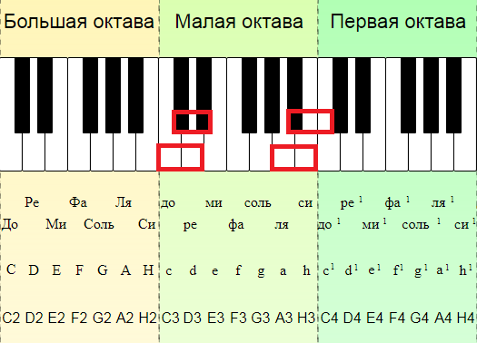
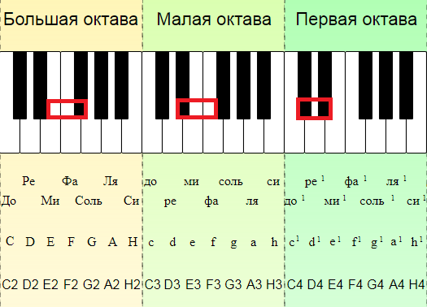

# Свойства звука

## Физические свойства звука
> **Звук** – это физическое явление, представляющее собой механические волновые колебания, которые распространяются в той или иной среде, чаще в воздухе.

Звук имеет физические свойства: высоту, силу (громкость), звуковой спектр (тембр).

Основные физические свойства звука:
- Высота определяется частотой колебаний и выражается в герцах (Гц).
- Сила звука (громкость) определяется амплитудой колебаний и выражается в децибелах (дБ).
- Звуковой спектр (тембр) зависит от дополнительных колебательных волн или обертонов, что образуются одновременно с основными колебаниями. Это хорошо слышно в музыке и пении.

Термин «обертон» происходит от двух английских слов: оver – «над», tone – «тон». От их сложения получается слово overtone или «обертон». Человеческий слух способен воспринимать звуки с частотой колебаний 16-20 000 герц (Гц) и громкостью 10-130 дБ.

Чтобы было проще ориентироваться, скажем, что 10 дБ – это шелест, а 130 дБ – это звук взлетающего самолета, если вы его слышите вблизи. 120-130 дБ – это уровень болевого порога, когда человеческому уху уже некомфортно слышать звук.

В плане высоты комфортным считается диапазон от 30 Гц примерно до 4000 Гц. К этой теме мы еще вернемся, когда будем говорить про музыкальную систему и звукоряд. Сейчас важно запомнить, что высота звука и громкость звука – это принципиально разные вещи. А пока поговорим про свойства музыкального звука.

## Свойства музыкального звука

Чем отличается музыкальный звук от любого другого? Это звук с одинаковыми и равномерно повторяющимися (т.е. периодическими) волновыми колебаниями. Звук с непериодическими, т.е. неодинаковыми и неравномерно повторяющимися колебаниями, не относят к музыкальному. Это шум, свист, вой, шелест, грохот, писк и многие другие звуки.

Другими словами, **музыкальный звук обладает всеми теми же свойствами, что и любой другой**, т.е. имеет высоту, громкость, тембр, но, только определенное сочетание этих свойств позволяет отнести звук к музыкальному. Что еще, кроме периодичности, имеет значение для музыкального звука?

Во-первых, музыкальным считается не весь слышимый диапазон, о чем мы будем подробнее говорить дальше. Во-вторых, для музыкального звука важна его длительность. Та или иная длительность звука на определенной высоте позволяет сделать акцент в музыке или, наоборот, оставить звучание плавным. Короткий звук в конце позволяет поставить логическую точку в музыкальном произведении, а длительный – оставить ощущение недосказанности у слушателей.

Собственно длительность звука зависит от продолжительности волновых колебаний. Чем дольше идут волновые колебания, тем дольше слышится звук. Чтобы понять взаимосвязь длительности музыкального звука и его остальных характеристик, стоит остановиться на таком аспекте как источник музыкального звука.

## Музыкальная система и звукоряд

Для более глубокого понимания свойств музыкального звука нам понадобятся еще несколько понятий. В частности, такие как музыкальная система и звукоряд:

- Музыкальная система – это совокупность используемых в музыке звуков определенной высоты.
- Звукоряд – это звуки музыкальной системы, идущие в восходящем или нисходящем порядке.

Современная музыкальная система включает в себя 88 звуков разной высоты. Они могут быть исполнены в восходящем или нисходящем порядке. Наиболее наглядная демонстрация взаимосвязи музыкальной системы и звукоряда – это клавиатура фортепиано.

88 клавиш фортепиано (36 черных и 52 белых – потом объясним, почему так) охватывают звуки высотой от 27,5 Гц до 4186 Гц. Такие акустические возможности достаточны, чтобы исполнить любую мелодию, комфортную для человеческого уха. Звуки за пределами данного диапазона в современной музыке практически не используются.

Звукоряд построен на определенных закономерностях. Звуки, частота которых различается в 2 раза (в 2 раза выше или ниже), воспринимаются на слух как сходные. Чтобы было удобнее ориентироваться, в теорию музыки введены такие понятия как ступени звукоряда, октава, тон и полутон.

## Ступени звукоряда, октава, тон и полутон

Каждый музыкальный звук звукоряда именуется ступенью. Расстояние между сходными звуками (ступенями звукоряда), отличающими по высоте в 2 раза, называется октавой. Расстояние между соседствующими звуками (ступенями) – полутоном. Полутона в пределах октавы равны (запомните, это важно). Два полутона образуют тон.

Основным ступеням звукоряда присвоены названия. Это «до», «ре», «ми», «фа», «соль», «ля», «си». Как вы поняли, это 7 нот, которые нам известны с детства. На клавиатуре фортепиано их можно найти, нажимая белые клавиши:

На цифры и латинские буквы пока не смотрите. Смотрите на клавиатуру и подписанные ступени звукоряда, они же ноты. Вы видите, что белых клавиш 52, а названий ступеней только 7. Это как раз связано с тем, что ступеням, которые имеют сходное звучания из-за отличия по высоте ровно в 2 раза, присвоены одинаковые названия.

Если мы нажмем подряд 7 клавиш фортепиано, 8-я по счету клавиша будет называться точно так, как та, которую мы нажали первой. И, соответственно, выдавать похожий звук, но на вдвое большей или меньшей высоте, смотря в какую сторону мы двигались.

Здесь требуется еще одно уточнение по терминам. Октавой именуется не только расстояние между сходными звуками (ступенями звукоряда), отличающими по высоте в 2 раза, но и 12 полутонов от ноты «до».

Можно встретить и другие определения термина «октава», используемые в теории музыки. Но, т.к. наша цель – дать основы музыкальной грамотности, мы не будем уходить глубоко в теорию, а ограничимся теми практическими знаниями, которые вам потребуются для обучения музыке и вокалу.

Для наглядности и пояснения прикладных значений термина снова воспользуемся клавиатурой фортепиано и увидим, что октава – это 7 белых клавиш и 5 черных.

## Нотно-октавная система

В целом диапазон потенциально слышимых человеческим ухом звуков охватывает почти 11 октав. Т.к. наш курс посвящен музыкальной грамоте, нас интересуют только музыкальные звуки, т.е. примерно 9 октав. Чтобы было проще запомнить октавы и соответствующие им диапазоны звуковысотности, рекомендуем идти сверху вниз, т.е. от верхнего диапазона звуков к нижнему. Звуковысотность в герцах по каждой октаве для удобства запоминания укажем в двоичной системе.

**Октавы (названия) и диапазоны:**
- **Пятая октава** – 4096-8192 Гц.
- **Четвертая октава** – 2048-4096 Гц.
- **Третья октава** – 1024-2048 Гц.
- **Вторая октава** – 512-1024 Гц.
- **Первая октава** – 256-512 Гц.
- **Малая октава** – 128-256.
- **Большая октава** – 64-128 Гц.
- **Контроктава** – 32-64 Гц.
- **Субконтроктава** – 16-31 Гц.

Прочие октавы в контексте музыкальных звуков рассматривать не имеет смысла. Так, самая высокая нота у мужчин – это «фа диез» 5-й октавы (5989 Гц), и установлен данный рекорд Амирхоссейном Молаи 31 июля 2019 года в городе Тегеран (Иран) [Guinness World Records, 2019]. Певец Димаш из Казахстана дотягивается до ноты «ре» в 5-й октаве (4698 Гц). А звуки высотой ниже 16 Гц человеческое ухо воспринимать не может.

## Ноты в октаве: варианты обозначения

Сегодня используются разные способы, чтобы обозначить принадлежность ноты (высоты звука) к разным октавам. Самый простой способ – записать названия нот, как они есть: «до», «ре», «ми», «фа», «соль», «ля», «си».

Второй вариант – это так называемая «нотация Гельмгольца». Такой способ предполагает обозначение нот латинскими буквами, а принадлежность к октаве – цифрами. Начнем с нот.

**Ноты по Гельмгольцу:**
- С = «до».
- D = «ре».
- E = «ми».
- F = «фа».
- G = «соль».
- A = «ля».
- B = «си».

Также важно отметить, что нота «си» иногда может обозначаться не буквой B, а буквой H. Буква H традиционна для классической музыки, а буква B считается более современным вариантом. В нашем курсе вы найдете обе вариации, поэтому помните, что и B, и H означают ноту «си».

Теперь к октавам. Ноты в первой-пятой октавах записываются маленькими латинскими буквами и обозначаются цифрами от 1 до 5. Ноты малой октавы – маленькими латинскими буквами без цифр. Запомните ассоциацию: малая октава – маленькие буквы. Ноты большой октавы записываются большими латинскими буквами. Запомните: большая октава – большие буквы. Ноты контроктавы и субконтроктавы записываются большими буквами и цифрами 1 и 2 соответственно.

**Ноты в октавах по Гельмгольцу:**
- Пятая октава – c5-b5.
- Четвертая октава – c4-b4.
- Третья октава – c3-b3.
- Вторая октава – c2-b2.
- Первая октава – c1-b1.
- Малая октава – c-b.
- Большая октава – С-В.
- Контроктава – С1-В1.
- Субконтроктава – С2-В2.

Если кого-то удивляет, почему первая нота октавы обозначается не первой буквой латинского алфавита, расскажем, что когда-то давно отсчет начинали с ноты «ля», за которой и закрепили обозначение А. Однако потом решили начинать октавный счет с ноты «до», за которой уже закрепилось обозначение С. Во избежание путаницы в нотных записях, решили сохранить буквенные обозначения нот, как есть.

Более подробно с нотацией Гельмгольца и другими его идеями вы можете ознакомиться в его работе, доступной на русском языке под названием «Учение о слуховых ощущениях как физиологическая основа для теории музыки» [Г. Гельмгольц, 2013].

И, наконец, научная нотация, которую разработало «Американское акустическое общество» в 1939 году и которая тоже актуальна до сих пор. Ноты обозначаются заглавными латинскими буквами, а принадлежность к октаве – цифрами от 0 до 8.

**Научная нотация:**
- Пятая октава – С8-В8.
- Четвертая октава – С7-В7.
- Третья октава – С6-В6.
- Вторая октава – С5-В5.
- Первая октава – С4-В4.
- Малая октава – С3-В3.
- Большая октава – С2-В2.
- Контроктава – С1-В1.
- Субконтроктава – С0-В0.

Обратите внимание, что цифры не совпадают с названиями октав от первой до пятой. Это обстоятельство часто вводит в заблуждение даже производителей специализированных программ для музыкантов. Поэтому в случае сомнений всегда проверяйте звучание и высоту ноты тюнером.

Осталось добавить, что впервые система научной нотации была обнародована в июльском номере The Journal of the Acoustical Society of America 1939 года.

Теперь обобщим все принятые на сегодняшний день системы обозначения нот для каждой октавы. Для этого еще раз продублируем уже знакомую вам картинку с клавиатурой фортепиано и обозначениями ступеней звукоряда (нот), но уже с рекомендацией обращать внимание на цифровые и буквенные обозначения:

И, наконец, для максимально полного понимания базовых сведений теории музыки, нам следует разобраться с разновидностями тонов и полутонов.

## Разновидности тонов и полутонов

Сразу скажем, что с прикладной точки зрения, для игры на музыкальных инструментах или обучения вокалу вам эти сведения особо не пригодятся. Однако термины, обозначающие виды тонов и полутонов, могут встретиться в специальной литературе. Поэтому о них нужно иметь представление, чтобы не останавливаться на непонятных моментах во время чтения литературы или углубленного изучения музыкального материала.

**Тон (виды):**
- Диатонический.
- Хроматический.

**Полутон (виды):**
- Диатонический.
- Хроматический.

Как видите, названия повторяются, так что запомнить будет нетрудно. Итак, разбираемся!

**Диатонический полутон (виды):**
- Полутон между 2 соседствующими основными ступенями (нотами) звукоряда E-F и B-C.
- Полутон между основной и соседствующей производной ступенью как на повышение, так и на понижение.
- Полутон между производными ступенями.

Некоторые примеры вы можете увидеть на картинке:

**Хроматический полутон (виды):**
- Полутон между основной нотой и следующей, пониженной либо повышенной.
- Полутон между повышением и двойным повышением ноты.
- Полутон между понижением и двойным понижением ноты.

**Диатонический тон (виды):**
- Тон между основными ступенями C-D, D-E, F-G, G-A, A-B.
- Любой тон, который не относится к хроматическому.

**Хроматический тон (виды):**
- Тон между 2 производными ступенями от основной ноты.
- Тон между нотами, находящимися через 1 ступень.

Уточним, что примеры взяты из учебника Варфоломея Вахромеева «Элементарная теория музыки» и для наглядности изображены на клавиатуре фортепиано, т.к. нотный стан мы будем изучать только на следующем уроке, а понятия тона и полутона нам нужны уже сейчас. В целом, мы еще неоднократно будем обращаться к трудам этого великого российского педагога и музыковеда на протяжении нашего курса.

К слову, в 1984 году за несколько месяцев до своей смерти Варфоломей Вахромеев был награжден Орденом Святого равноапостольного князя Владимира 2-й степени за составленный им «Учебник церковного пения» для духовных школ РПЦ. Учебник выдержал несколько переизданий уже после его смерти.

> Еще одна важная информация, которая нам нужна прежде, чем мы перейдем к нотной грамоте. Нам уже встретились понятия повышения и понижения основной ступени звукоряда. Так вот, повышение ступени обозначается словом и значком диез (♯), а понижение – словом и значком бемоль (♭).

Повышение на 2 полутона обозначается двойным диезом или дубль-диезом, понижение на 2 полутона обозначается двойным бемолем или дубль-бемолем. Для двойного диеза есть специальный значок, похожий на крестик , но, т.к. его трудно подобрать на клавиатуре, может использоваться обозначение ♯♯ или просто две решетки ##. С дубль-бемолями проще, пишут либо 2 значка ♭♭, либо латинские буквы bb.

И, наконец, последнее, о чем нужно поговорить в теме «Свойства звука», это энгармонизм звуков. Ранее вы узнали, что полутона в пределах октавы равны. Поэтому звук, сниженный на полутон относительно основной ступени, будет равен по высоте звуку, повышенному на полутон относительно ступени, стоящей двумя полутонами ниже.

Проще говоря, ля-бемоль (А♭) и соль-диез (G♯) одной и той же октавы звучат идентично. Точно так в пределах октавы одинаково прозвучат соль-бемоль (G♭) и фа-диез (F♯), ми-бемоль (Е♭) и ре-диез (D♯), ре-бемоль (D♭)и до-диез (С♯) и т.д. Явление, когда одинаковые по высоте звуки имеют разные названия и обозначаются разными символами, называется энгармонизмом звуков.

Для простоты восприятия мы продемонстрировали это явление на примере ступеней (нот), между которыми имеется 2 полутона. В других случаях, когда между основными ступенями всего 1 полутон, это менее наглядно. К примеру, фа-бемоль (F♭) – это чистая нота ми (Е), а ми-диез (Е♯) – это чистая нота фа (F). Тем не менее в специальной литературе по теории музыки могут встретиться и такие обозначения как фа-бемоль (F♭) и ми-диез (Е♯). Вы теперь знаете, что они значат.

Сегодня вы изучили основные физические свойства звука вообще и свойства музыкального звука в частности. Вы разобрались с музыкальной системой и звукорядом, ступенями звукоряда, октавами, тонами и полутонами. Также вы разобрались в нотно-октавной системе.

